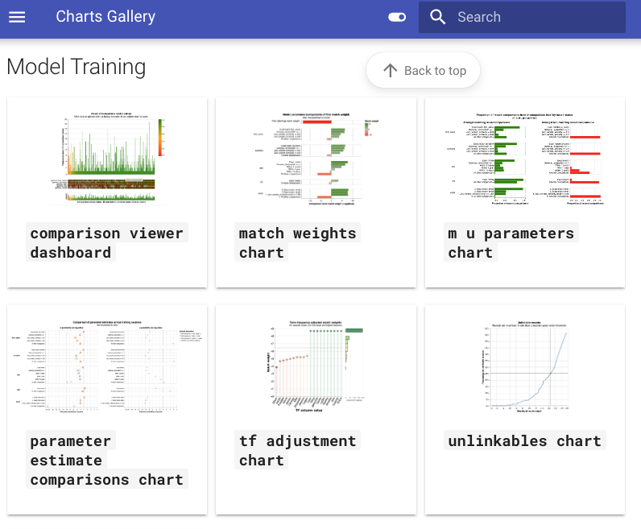

# Splink Updates - December 2023

Welcome to the second installment of the Splink Blog!

Here are some of the highlights from the second half of 2023, and a taste of what is in store for 2024!

<!-- more -->

Latest Splink version: [v3.9.10](https://github.com/moj-analytical-services/splink/releases/tag/v3.9.10)

## :bar_chart: Charts Gallery

The Splink docs site now has a [Charts Gallery](../../charts/index.md) to show off all of the charts that come out-of-the-box with Splink to make linking easier.

[{ width="400" }](../../charts/index.md)

Each chart now has an explanation of:

1. What the chart shows
2. How to interpret it
3. Actions to take as a result

This is the first step on a longer term journey to provide more guidance on how to evaluate Splink models and linkages, so watch this space for more in the coming months!

## :chart_with_upwards_trend: New Charts

We are always adding more charts to Splink - to understand how these charts are built see our new [Charts Developer Guide](../../dev_guides/charts/understanding_and_editing_charts.md).

Two of our latest additions are:

### :material-matrix: Confusion Matrix

When evaluating any classification model, a confusion matrix is a useful tool for summarising performance by representing counts of true positive, true negative, false positive, and false negative predictions.

Splink now has its own [confusion matrix chart](../../charts/threshold_selection_tool_from_labels_table.ipynb) to show how model performance changes with a given match weight threshold.

[{ width="400" }](../../charts/threshold_selection_tool_from_labels_table.ipynb)

Note, labelled data is required to generate this chart.

### :material-table: Completeness Chart

When linking multiple datasets together, one of the most important factors for a successful linkage is the number of common fields across the datasets.

Splink now has the [completeness chart](../../charts/completeness_chart.ipynb) which gives a simple view of how well populated fields are across datasets.

[](../../charts/completeness_chart.ipynb)


## :clipboard: Settings Validation

The [Settings dictionary](../../api_docs/settings_dict_guide.md) is central to everything in Splink. It defines everything from the SQL dialect of your backend to how features are compared in Splink model.

A common sticking point with users is how easy it is to make small errors when defining the Settings dictionary, resulting in unhelpful error messages.

To address this issue, the [Settings Validator](https://web.archive.org/web/20250701194538/https://moj-analytical-services.github.io/splink/dev_guides/settings_validation/settings_validation_overview.html) provides clear, user-friendly feedback on what the issue is and how to fix it.


## :simple-adblock: Blocking Rule Library (Improved)

In our [previous blog](../posts/2023-07-27-feature_update.md) we introduced the Blocking Rule Library (BRL) built upon the `exact_match_rule` function. When testing this functionality we found it pretty verbose, particularly when blocking on multiple columns, so figured we could do better. From Splink v3.9.6 we introduced the `block_on` function to supersede `exact_match_rule`.

For example, a block on `first_name` and `surname` now looks like:

```py
from splink.duckdb.blocking_rule_library import block_on
block_on(["first_name", "surname"])
```

as opposed to

```py
import splink.duckdb.blocking_rule_library as brl
brl.and_(
  brl.exact_match_rule("first_name"),
  brl.exact_match_rule("surname")
)
```

All of the [tutorials](../../demos/tutorials/03_Blocking.ipynb), [example notebooks](../../demos/examples/examples_index.md) and docs have been updated to use `block_on`.

## :electric_plug: Backend Specific Installs

Some users have had difficulties downloading Splink due to additional dependencies, some of which may not be relevant for the backend they are using. To solve this, you can now install a minimal version of Splink for your given SQL engine.

For example, to install Splink purely for Spark use the command:

```bsh
pip install 'splink[spark]'
```

See the [Getting Started page](../../getting_started.md#backend-specific-installs) for further guidance.

## :no_entry_sign: Drop support for python 3.7

From Splink 3.9.7, support has been dropped for python 3.7. This decision has been made to manage dependency clashes in the back end of Splink.

If you are working with python 3.7, please revert to Splink 3.9.6.

```bsh
pip install splink==3.9.6
```

## :soon: What's in the pipeline?

* :four:   Work on **Splink 4** is currently underway
* :material-thumbs-up-down:   More guidance on how to evaluate Splink models and linkages


