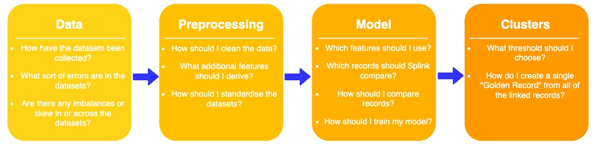

# Ethics in Data Linking

Welcome to the next installment of the Splink Blog where we’re talking about Data Ethics!

## :question: Why should we care about ethics?

Splink was developed in-house at the UK Government’s Ministry of Justice. As data scientists in government, we are accountable to the public and have a duty to maintain public trust. This includes upholding high standards of data ethics in our work.

<!-- more -->

Furthermore, data linkage is generally used at the start of analytical projects so any design decisions that are made, or biases introduced, will have consequences for all downstream use cases of that data. With this in mind, it is important to try and address any potential ethical issues at the linking stage.

## :link: Ethics and Splink

### What do we already have in place?

Data ethics has been a foundational consideration throughout Splink’s development. For example, the decision to make Splink open-source was motivated by an ambition to make our data linking software fully transparent, accessible and auditable to users both inside and outside of government. The fact that this also empowers external users to expand and improve upon Splink’s functionality is another [huge benefit](https://www.robinlinacre.com/open_source_dividend/)!

Another core principle guiding the development of Splink has been explainability. Under the hood we use the [Fellegi-Sunter model](../../topic_guides/theory/fellegi_sunter.md) which is an industry-standard, well-researched, explainable methodology. This, in combination with interactive charts such as the [waterfall chart](../../charts/waterfall_chart.ipynb), where model results can be easily broken down and visualised for individual record pairs, make Splink predictions easily interrogatable and explainable. Being able to interrogate predictions is especially valuable when things go wrong - if an incorrect link has been made you can trace it back see exactly why the model made the decision.

### What else should we be considering?

To continue our exploration of ethical issues, we recently had a team away day focused on data ethics. We aimed to better understand where ethical concerns (e.g. bias) could arise in our own Splink linkage pipelines and what further steps we could take to empower users to be able to better understand and possibly mitigate these issues within their own projects. 

We discussed a typical data linking pipeline, as used in the Ministry of Justice, from data collection at source through to the generation of Splink cluster IDs. It became clear that there are considerations to make at each stage of a pipeline that can have an ethical implications such as:

For example, a higher occurrence of misspellings for names of non-UK origin during data collection can impact the accuracy of links for certain groups.

As you can see, the entire data linking process has many stages with lots of moving parts, resulting in numerous opportunities for ethical issues to arise. 

### What are we going to do about it?

Summarised below are the key areas of ethical concern we identified and how we plan to address them.

#### :material-thumbs-up-down: Evaluation

Splink is not plug and play. As a software, it provides many configuration options to support its users, from [blocking rules](../../topic_guides/blocking/blocking_rules.md) to [term frequency adjustments](../../topic_guides/comparisons/term-frequency.md). However, with greater flexibility comes greater variation in model design. From an explainability and quality assurance perspective, it is important to understand how different choices on model build interact and can influence results.

It isn’t trivial to unpick the interplaying factors that affect Splink’s outputs, but as a first step we are building a framework and guidance to demonstrate how changes to a model's settings can impact predictions. We hope this will give users a better understanding of model sensitivity and more confidence in explaining and justifying the results of their models. We also hope this will serve as a stepping stone to tools that help evaluate models in a production setting (e.g. model drift).

#### :scales: Bias 

Bias is a key area of ethical concern within data linking and one that crops up at many stages during a typical linking pipeline; from data collection to downstream linking. It is important to identify, quantify and, where possible, mitigate bias in input sources, model building and outputs. However, sources of bias are specific to a given use-case, and therefore finding general solutions to mitigating bias is challenging.

This year we are embarking on a collaboration with the [Alan Turing Institute](https://www.turing.ac.uk/) to get expert support on assessing bias in our linking pipelines. The long-term goal is to create general tooling to help Splink users gain a better understanding of how bias could be being introduced into their models. Improved model evaluation (see above) is a first step in the development of these tools.

#### :loudspeaker: Communication

Sharing both our current knowledge and future discoveries on the ethics of data linking with Splink is important to help support our users and the data linking community more broadly. This blog is the first step on that journey for us.

As already mentioned, Splink comes with a variety of tools that support explainability. We will be updating the Splink documentation to convey the significance of these resources from a data ethics perspective to help give existing users, potential adopters and their customers greater confidence in building Splink models and model predictions.

Please visit the [Ethics in Data Linking discussion](https://github.com/moj-analytical-services/splink/discussions/1878) on Splink's GitHub repository to get involved in the conversation and share your thoughts - we'd love to hear them!

If you want to stay up to date with the latest Splink blogs subscribe to our new [:simple-rss: RSS feed](https://moj-analytical-services.github.io/splink/feed_rss_created.xml)! 
