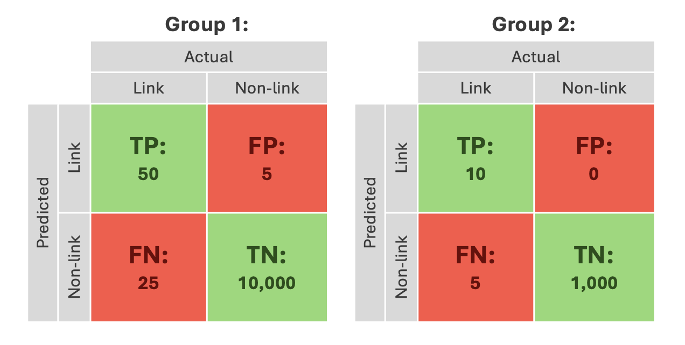

# Bias in Data Linking: _Progress and next steps_

In March 2024, the Splink team launched a six-month _'Bias in Data Linking'_ internship with the [Alan Turing Institute](https://www.turing.ac.uk). This installment of the Splink Blog is going to introduce the internship, its goals, and provide an update on what's happened so far.

<!-- more -->

The internship is being undertaken by myself, Erica Kane. I am a PhD student based at the University of Leeds. My doctoral research is in Data Analytics, conducted in partnership with the Parole Board. I have a background in quantitative research within Criminal Justice.

## 📝 Background

The internship stemmed from the team's [previous engagement with ethics](https://moj-analytical-services.github.io/splink/blog/2024/01/23/ethics-in-data-linking.html), understanding that this complex yet inevitable aspect of data science has implications for data linking. 

Data science pipelines are intricate processes with lots of decision points. At each of these decision points bias can creep in. If it does, its impact on results can vary as it interacts with different parts of the pipeline. For example, two datasets might react differently to the same bias introduced by a model. Additionally, multiple biases can interact with each other, making it difficult to see their individual effects. Therefore, detecting, monitoring, quantifying, and mitigating bias in data science pipelines is extremely challenging.

Bias can enter a data linking pipeline through two main areas - the **input data** and the **model design**: 

{ width="650" height="310" }

The input data can contain mistakes (misspellings of names), or legitimate qualities (changing names) which make some records harder to link than others. If these mistakes or qualities are not random, this means the input data will introduce bias. Addressing these mistakes or qualities through data preparation can also introduce bias through standardisation (character removal) or feature-engineering (phonetic representations of names).

Model design settings such as blocking rules (exact name matches) or comparison algorithms (Jaro-Winkler similarity) dictate which records are compared and how they are compared. If these design choices result in a better/worse performance for certain record types, bias will be introduced.

These upstream biases will impact the resulting linked data. When examining a dataset produced by a linkage pipeline, it's difficult to figure out _how_ exactly the biases in the pipeline have affected the data and pinpoint _where_ these biases came from.

## 🪜 Initial steps

The project began by conducting an initial review to address four main areas in relation to bias in data linking: 

**1. Materials**

Both the [wider government](https://www.gov.uk/government/collections/algorithmic-transparency-recording-standard-hub) and the [MoJ](https://www.turing.ac.uk/research/research-projects/building-ethical-framework-data-science-and-ai-criminal-justice-system) have been increasingly focused on the ethics of data science and data linking. Additionally, the Splink team had produced materials from a dedicated ethics away day and blog post. 

**2. Interest areas**

Talking with users and developers of different linkage applications was key to identifying where bias might exist in a pipeline. Their deep understanding of the input data and model design helped pinpoint these interest areas.

**3. Methods or functionality**

Several well-established performance evaluation strategies exist, like using [charts](https://moj-analytical-services.github.io/splink/topic_guides/evaluation/model.html) to explore models, [metrics](https://moj-analytical-services.github.io/splink/topic_guides/evaluation/edge_metrics.html) to analyse links, and [clusters](https://moj-analytical-services.github.io/splink/topic_guides/evaluation/clusters/overview.html) to review the output data. However, it wasn't clear if they could be used to address bias. 

**4. Useful output**

The main goal was to find out what users and developers of data linkage pipelines really need to tackle bias. While ideally, bias would be completely eliminated, most would settle for a controlled approach that’s flexible for their needs but still provides clear, standardised guidance.

## 🎯 Goals

It was then time to establish some goals. These were based on an understanding of the complexities of dealing with bias in data science, and the findings of the initial review. 

Three key goals were defined: 

&#9733; Identify **areas of bias** within data linking pipelines.  
&#9733; Understand if/how this bias **impacts performance**.   
&#9733; Help users/developers **understand and investigate** this bias. 

They were left relatively open-ended to allow for flexibility in the approach.  

## 🔍 Clerical review

Clerical review involves human experts manually checking and labelling data to establish a 'true' sample. This sample can be compared to predicted outcomes to shed light on how well an algorithm is performing. This is widely used in various data science fields like detection, prediction, and classification. It can also be used to evaluate data linkage by labelling record comparisons (deciding if they relate to the same person), before using these labels to calculate performance metrics. 

### <u>Concept</u>

Clerical review could be performed by any data linking user with labelled data. A standard approach usually focuses on overall performance, but the core methods and functionality could be adapted into an evaluation framework to tackle bias.

This framework could guide users through a clerical review process to investigate bias, offering practical tips on creating labelled samples, selecting records for comparison, choosing metrics, and interpreting results. Before creating this framework, it was important to make sure that a clerical review process was the right fit for this purpose.

This involved three main investigatory steps:

{ width="650" height="250" }

### <u>Approach</u>

If all stages proved suitable, the framework would be developed.

**Step 1**

First, it was necessary to understand a clerical review process for data linking, including how to decide if records relate to the same person.

This review revealed uncertainties in establishing a clear ground truth...

 This highlights the need for complex linking methods - if record relationships were obvious, probabilistic data linking wouldn't be necessary. Therefore, this ambiguity is inherent to labelling real data. Additionally, linkage algorithms will perform well with clearly related records, so it is the ambiguous links that are the most interesting when addressing bias. 

**Step 2**

Bias performance evaluation is different from overall performance evaluation because it focusses on specific records rather than making big-picture conclusions.

In data linking, locating these records leads to two main issues:

1. Using demographic variables (like gender or ethnicity) to represent records of interest is problematic because it relies on accurate data recording.  

2. Directly identifying records of interest is nearly impossible without a ground truth, requiring complex methods that might introduce more bias.

**Step 3**

After creating labels and establishing samples, the next step is to assess performance. This normally involves using labelled comparisons and predicted outcomes to calculate metrics like precision and recall. Bias can be comparing performance across the different records of interest.  

Consider a scenario where performance is measured between two groups (a majority and minority demographic). In data linking, you might see results like:

{ width="600" height="300" }

These results would equate to a recall of 0.67 for both groups, and a precision of 0.91 for Group 1 and 1 for Group 2. 

Comparing these results to make conclusions on bias is difficult. At a surface level, it might seem like the pipeline is biased against Group 1, but there are some factors to consider...

- There are **limited comparisons** for anything other than TNs. 
- The minority demographic is **underrepresented**. 
- The **source of the bias** is not indicated in these results.

Considering the findings from Step 1 and Step 2, there are some extra considerations... 

- 'Actual' labels are based on an ambiguous **ground truth**.
- **Records of interest** might not be represented in the defined groups. 

## 💡 Conclusions 

A bias evaluation framework using a clerical review approach was not developed. The investigation showed that for data linking, the labelling process, comparison samples, and evaluation methods could not provide a solid foundation for bias investigation. This is due to the inherent ambiguity of using real data to investigate performance. 

As a result, we're now exploring alternative data linking bias review approaches - **keep an eye out for future updates**!

