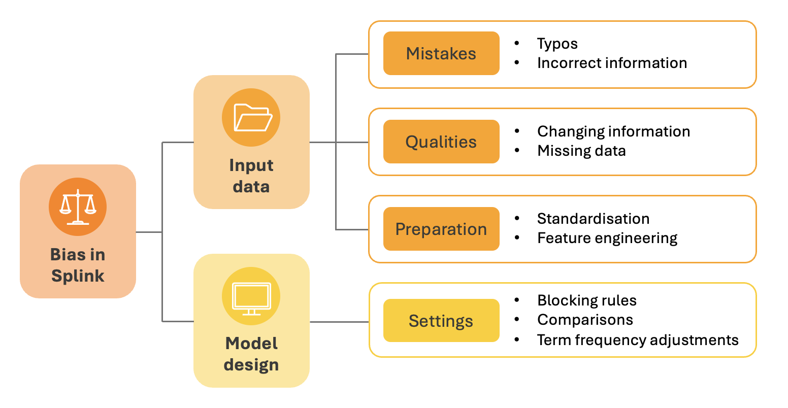
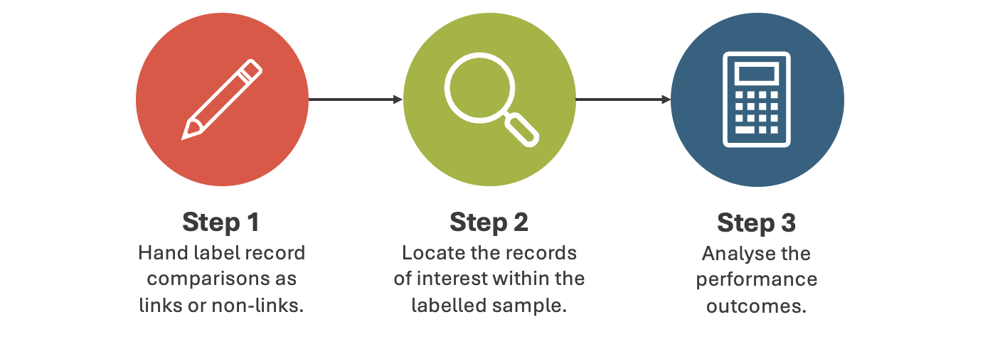

# Bias in Data Linking

In March 2024, the Splink team launched a 6-month _'Bias in Data Linking'_ internship with the [Alan Turing Institute](https://www.turing.ac.uk). This installment of the Splink Blog is going to introduce the internship, its goals, and provide an update on what's happened so far.

<!-- more -->

The internship is being undertaken by myself, Erica Kane. I am a PhD student based at the University of Leeds. My doctoral research is in Data Analytics, conducted in partnership with the Parole Board, and I have a background in quantitative research within Criminal Justice.

## 📝 Background

The internship stemmed from the team's [previous engagement with ethics](https://moj-analytical-services.github.io/splink/blog/2024/01/23/ethics-in-data-linking.html), understanding that this complex yet inevitable aspect of data science has implications for data linking. 

Data science pipelines are intricate processes with lots of decision points. At each of these decision points bias can creep in. If it does, its impact on results can vary as it interacts with different parts of the pipeline. For example, two datasets might react differently to the same bias introduced by a model. Additionally, multiple biases can interact with each other, making it difficult to see their individual effects. Therefore, detecting, monitoring, quantifying, and mitigating bias in data science pipelines is extremely challenging.

## 🎯 Goals

To set the direction for the internship, it was useful to first define what a successful outcome would look like. 

Many users and developers of data linking pipelines have ideas about where bias _might_ be entering their pipeline, but they aren’t always sure _how_ to evaluate this bias or understand its impact. So, the goal was to create a **standardised approach to evaluating bias** that’s adaptable to different use cases.

Before developing this approach, it was useful to look at different types and sources of bias in data linking pipelines. This made sure that the development was grounded in real-life examples, which was crucial for assessing if an evaluation method was suitable.

## 🔍 Sources of bias

From talking with experts and reviewing relevant materials, it was clear that there were already hypotheses about where bias might enter a data linking pipeline. 

These hypotheses were reviewed and grouped into broad categories, highlighting the key areas for evaluation:

The **input data** can contain mistakes or legitimate qualities which make some records harder to link than others. Addressing these mistakes or qualities through data preparation techniques can have the same effect. If this impact is not random, this means the input data will introduce bias.

**Model design** involves specifying settings that define which records to compare and how to compare them. If these design choices result in a better/worse performance for certain record types, bias will be introduced.

Understanding these potential bias sources laid the groundwork for determining the most suitable evaluation method.

## 📊 Evaluating bias 

There are many ways to evaluate performance in data science, and a common approach is to compare the output of a model with a ground truth. In data linking, this means manually labelling comparisons as "link" or "non-link", running them through the pipeline, and then comparing the predicted results to these labels. 

Since this method is commonly used to measure overall performance, labelled data may already exist. If this is the case, it's worth exploring how these labels could be repurposed to evaluate bias instead. This requires a more focussed approach, where it's necessary to pinpoint specific records that align with a defined hypothesis. These might include records that represent mistakes, qualities, or preparation of the input data, or those affected by model design settings.

Assuming there's already a hypothesis in place, this approach involves a 3-step process: 

Each step was reviewed to understand the considerations for evaluating bias...

### **Step 1: Hand label record comparisons**

Firstly, a sample of record pairs are labelled by human experts to decide if they relate to the same person. This sample provides the base from which performance is assessed.

When working with real data, it's not always clear whether records relate to the same individual... 

Even human evaluators can struggle, and individuals often disagree. In these uncertain cases, there is a risk of bias being introduced into the labels by the evaluators themselves. The lack of consistency or reliability of labels makes it hard to consider them a "ground truth" from which to assess bias.

### **Step 2: Identify records**

The second step is to focus the evaluation on bias by identifying records that represent the specific hypothesis. Issues with this process are demonstrated by the following example:

_Bias is suspected to enter a pipeline through data standardisation using an English phonetic algorithm (e.g. Metaphone)._ 

Records with non-English phonetic names must be identified for evaluation. There are two main options to identify these records, both with associated drawbacks.

1. Using variables as proxies
    - Assumes a relationship between the variable and name phonetics (e.g. ethnicity/nationality)
    - Relies on accurate recording of the variable 
    
2. Direct identification
    - Requires a complex technical solution which would be difficult to develop and verify

These issues are applicable to most hypotheses, and both options are likely to introduce additional bias.

### **Step 3: Assess the performance**

The final step is to assess performance outcomes by comparing the labelled data with the pipeline’s predictions. In bias evaluation, understanding where the model goes wrong is of particular interest (false positives and false negatives). 

A high-level typical data linking performance may look like this:

This represents the reality of the dominant class (non-links) in data linking, as most records which are compared will not relate to the same individual. This leaves very few errors to evaluate within a large sample of labels. When analysing for bias, the focus would be on an even smaller subset of records of interest. 

A bias specific data linking performance may look like this:

This further reduces the absolute number of examples, making it difficult to quantify the impact of any bias. 

Getting enough useful examples is possible, but impractical. It would require either dedicating a lot of resources to labelling or using a sampling method that could introduce additional bias.

## 💡 Conclusions 

The internship aims to develop an approach that helps users of data linking pipelines evaluate suspected bias. This first blog covers the initial steps taken to figure out what the evaluation process could look like.

Looking into how a common performance evaluation strategy handles bias investigation in data linking uncovered three main issues:

1. Manual labelling does not give a reliable "ground truth".
2. Records of interest for a specific hypothesis are difficult to identify.
3. Gathering large samples of FPs and FNs is impractical.

These challenges stem from working with real data and make this approach unsuitable for bias evaluation. We’re currently looking into alternative options — **stay tuned for updates!**
