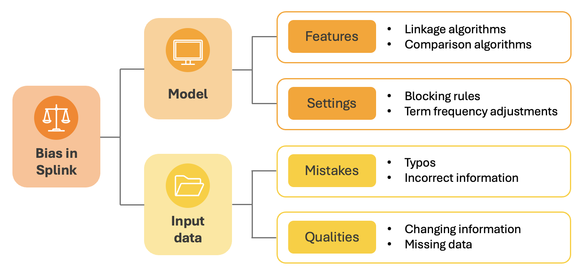
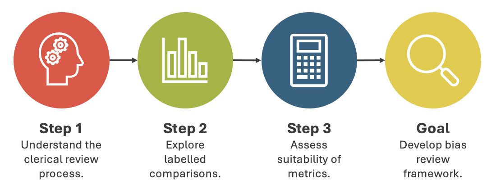
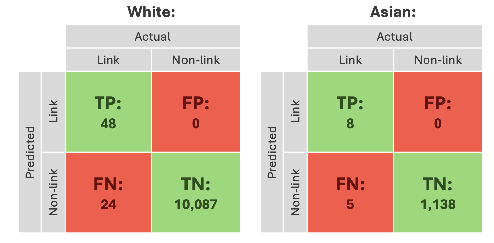

# Bias in data linking: _Progress and next steps_

In March 2024, the Splink team launched a six-month _'Bias in data linking'_ internship with the [Alan Turing Institute](https://www.turing.ac.uk). This installment of the Splink Blog is going to introduce the internship, its goals, and provide an update on what's happened so far.

<!-- more -->

## 📝 Background

The internship stemmed from the team's [previous engagement with ethics](https://moj-analytical-services.github.io/splink/blog/2024/01/23/ethics-in-data-linking.html), understanding that this complex yet inevitable aspect of data science has implications for Splink. 

Data science pipelines are intricate processes with lots of decision points. At each of these decision points bias can creep in. If it does, its impact on results can vary as it interacts with different parts of the pipeline. For example, two datasets might react differently to the same bias introduced by a model. Additionally, multiple biases can interact with each other, making it difficult to see their individual effects. Therefore, detecting, monitoring, quantifying, and mitigating bias in data science pipelines is extremely challenging.

Bias can enter a Splink pipeline through two main areas - the **input data** and the **model**: 

  

The input data can contain mistakes (e.g. misspellings of names), or legitimate qualities (e.g. changing names) which make some records harder to link than others. If these mistakes or qualities are not random, this means the input data will introduce bias. 

The model itself can also introduce bias into the pipeline. This can be through the model's underlying features (e.g. a Double Metaphone name comparison algorithm), or the user-defined settings (e.g. blocking rules). If these model elements result in a better/worse performance for certain record types, the model will introduce bias. 

In data linking, these upstream biases will impact the resulting linked data. When examining a dataset produced by a linkage pipeline, it's difficult to figure out _how_ exactly the biases in the pipeline have affected the data and pinpoint _where_ these biases came from.

## 🪜 Initial steps

The project began by conducting an initial bias review to address four questions: 

**1. What materials or resources have already been created in relation to bias?**

There are lot of useful materials that the team have produced internally, including blog posts and insights from a dedicated away day. Ethics has also been engaged with more broadly by the [MoJ](https://www.turing.ac.uk/research/research-projects/building-ethical-framework-data-science-and-ai-criminal-justice-system) and [wider government](https://www.gov.uk/government/collections/algorithmic-transparency-recording-standard-hub). 

**2. Are there any areas of the pipeline that the team/users suspect may contain bias?**

The team have put a lot of thought into the areas of a Splink pipeline where bias could enter. These are based off a deep understanding of the model, guided by strong connections with users and data. [_SUMMARY TABLE?_](https://docs.google.com/document/d/1__jc25D9YKAQdkPDLllDPSdIz3fxO1LAa-kY6AW011g/edit)

**3. Is there established Splink functionality which could support bias evaluation?** 

Splink has several pre-developed methods of [performance evaluation](https://moj-analytical-services.github.io/splink/topic_guides/evaluation/overview.html) These include insightful [charts](https://moj-analytical-services.github.io/splink/topic_guides/evaluation/model.html) for model insights, edge based [metrics](https://moj-analytical-services.github.io/splink/topic_guides/evaluation/edge_metrics.html) derived from labelled data, and [dashboards](https://moj-analytical-services.github.io/splink/topic_guides/evaluation/clusters/overview.html) for cluster evaluation. Using these pre-developed tools for bias analysis would be efficient given the six-month timeframe.

**4. What output would be the most useful for the Splink team/users?**

The most useful output would be practical guidance to provide users and developers with a controlled approach for bias investigation.

## 🎯 Goals

It was then time to establish some goals. These were based off an understanding of the complexities of dealing with bias in data science, and the findings of the initial bias review. 

Three key goals were defined: 

&#9733; Identify **areas of bias** within Splink pipelines.  
&#9733; Understand if/how this bias **impacts performance**.   
&#9733; Help users **understand and investigate** this bias. 

These goals were left relatively open-ended to allow for flexibility in the approach to bias investigation in Splink.  

## 🔍 Clerical review

Clerical review involves human experts manually checking and labelling data to establish a 'true' sample. This sample can be compared to predicted outcomes to shed light on how well an algorithm is performing. This is widely used in various data science fields like detection, prediction, and classification. It also forms an important part of Splink's performance evaluation strategy, and the team have labelled thousands of record comparisons to determine if they relate to the same person. 

Therefore, this approach was identified as a potential way to utilise existing functionality to achieve the internship's goals.

### <u>Concept</u>

The clerical review approach can be extended to all Splink users with labelled data. Currently, its focus is on overall performance rather than bias. However, the existing tools (metrics and charts) could be adapted into a standardised bias evaluation framework for any Splink application.

This framework would guide users through using a clerical review process to investigate bias, providing practical tips on creating labelled samples, identifying records for performance comparison, choosing metrics, and interpreting results. Before developing the framework, it was essential to ensure the clerical review process was suitable and adaptable for this purpose.

This involved three main investigatory steps:

  

### <u>Approach</u>

These steps were taken to assess if elements of the clerical review process (creating labels, samples of labelled comparisons, and metric calculations) could serve as a basis for the bias review framework. If all stages proved suitable, the framework would be developed.

**Step 1**

First, it was necessary to understand the clerical review process, including how records were selected, how decisions on matching records were made, the storage of labelled samples, and the available information.

This review revealed uncertainties in establishing a clear 'ground truth', as determining if records belong to the same person is challenging (even for human evaluators)...

  

 This highlights the need for complex linking methods - if record relationships were obvious, Splink wouldn't be necessary. Therefore, this ambiguity is inherent to labelling real data. Additionally, Splink performs well with clearly related records, so it is the ambiguous links that are the most interesting when addressing bias. 

**Step 2**

Next, labelled samples were explored to understand the types of records they contained. This included the number of comparisons, linked and unlinked records, demographic breakdowns, and missing data. Two issues emerged.

First, investigating bias based on demographics like gender or ethnicity presents problems. The evaluation's success depends on potentially poorly recorded or missing data, which may not be randomly distributed. Additionally, the relevant demographics often represent a small portion of the overall sample, severely reducing comparisons of interest.

Not using demographic factors as a proxy for biased record features introduces the second issue. Identifying the record features directly (such as typos, name-origins, or matching records with changing details) in the absence of a ground truth is impossible without complex technical approaches which would introduce more bias. 

**Step 3**

The third step examined current performance metrics like precision and recall to assess their effectiveness in uncovering biases. This involved calculating and interpreting these metrics to see if they provide enough data to detect, quantify, and mitigate bias.

The main issue was that without a ground truth and the difficulty in identifying record types of interest, these metrics are hard to interpret. For example, when investigating if performance differs between comparisons with white and Asian individuals:

  

These results would equate to a precision of 1 for both, and a recall of 0.67 for white and 0.62 for Asian. While this suggests that Splink could perform worse for Asian record comparisons, the results should be approached with caution because:

- There are **limited comparisons** for anything other than TNs. 
- Comparisons containing **minority demographics** are underrepresented. 
- The performance of records with **missing information** on ethnicity is excluded.
- Many 'Actual' labels will not represent a **ground truth**. 
- The **source of the bias** is not indicated in these results (data/model/both).

## 💡 Conclusions 

We decided not to develop a bias evaluation framework using the clerical review approach. The investigation showed that the labelling process, label samples, and evaluation methods could not provide a solid foundation for bias investigation. This was due to the inherent ambiguity in real data, and the difficulty of identifying interest areas within it. These issues mean that performance metrics based on real data are hard to draw meaningful conclusions from in terms of bias.

As a result, we're now exploring alternative bias review approaches within Splink - **keep an eye out for future updates**!

