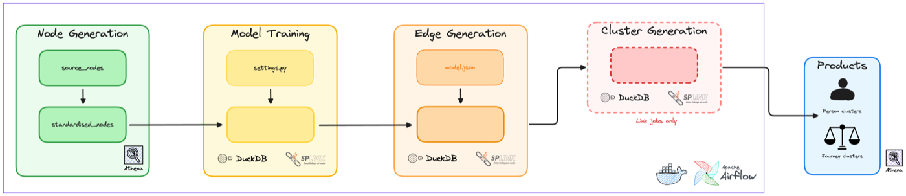
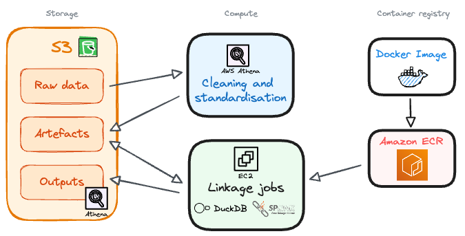
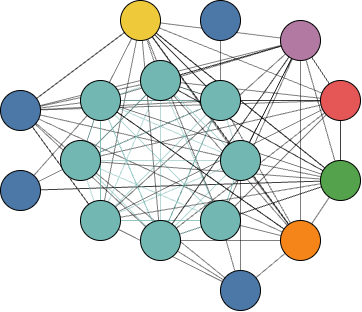
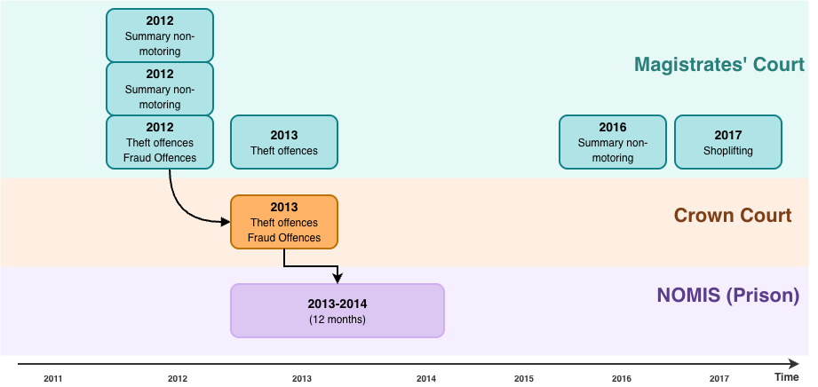
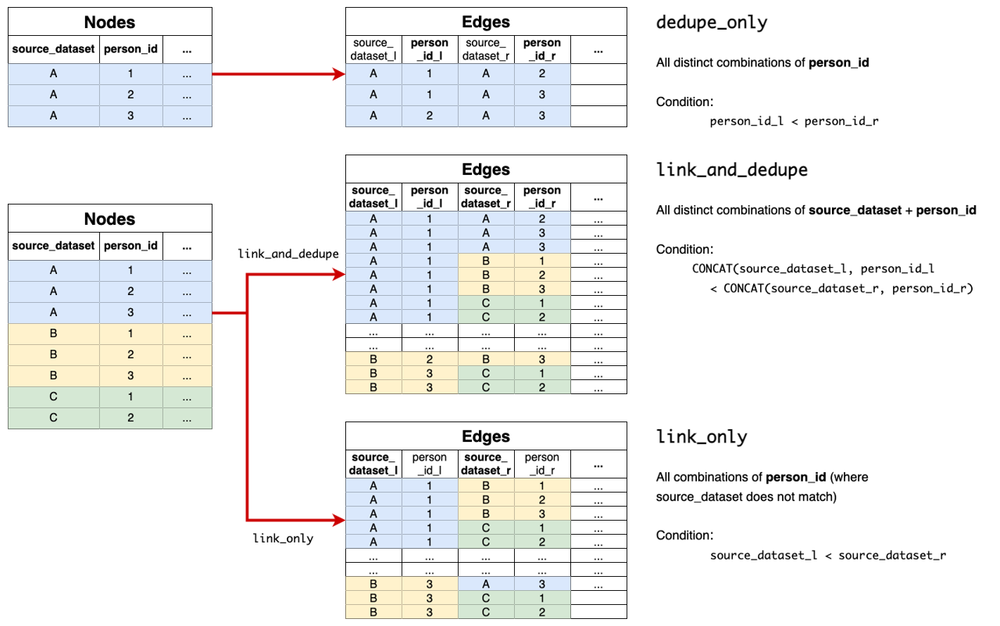
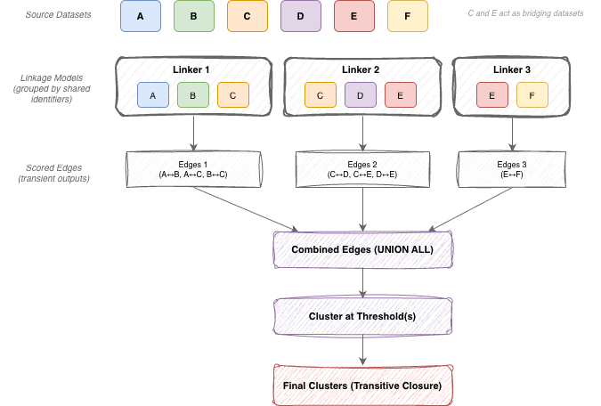

# Running Splink in Production at the Ministry of Justice

We have published plenty on record linkage theory, Splink's capabilities, and how to build a model. What we have not covered in depth is the engineering side of running linkage as a repeatable data product at scale. Splink gives you the statistical machinery, but it is intentionally unopinionated about how you productionise it.

Getting Splink to run once is usually straightforward. Getting it to run every week, across multiple datasets, while keeping outputs auditable and recoverable is the harder part.

This post sets out how we do that at the Ministry of Justice, how we keep the pipeline modular rather than fragile, and how we catch issues early enough to recover safely.

<!-- more -->

## What this post covers, and what it does not

This post focusses on how we compose and operate linkage pipelines:

- how we structure the directed acyclic graph (DAG) and its stages
- how we separate parameter estimation from prediction so weekly runs are cheaper and more repeatable
- how we scale from "one dataset" to "many datasets" without turning it into one fragile job
- how we persist artefacts, graphs, and evaluation charts so the process is auditable and debuggable

The post is about the mechanics of our pipelines, so it does not cover:

- the statistics behind Splink, training mechanics, or parameter estimation detail
- evaluation strategy and threshold selection
- ethical considerations and governance

It is written for people who already have a working understanding of entity resolution, Splink, and data engineering fundamentals. It is intended to be concrete, but it does not re-teach linkage theory.

!!! note

    Where it helps, I use footnotes to point to Splink documentation rather than duplicating it.

## The linkage dilemma, why many datasets changes the shape of the problem

Linking a single dataset to itself (deduplication), or linking two datasets together, is a fairly contained problem. Once you start linking many datasets on a schedule, the shape of the work changes.

With k datasets, there are $k \times (k - 1) / 2$ possible cross-dataset pairs to consider. Three datasets gives you three pairs, and four gives you six.

By the time you get to eight datasets, that is 28 cross-dataset comparisons, before you have even thought about deduplicating within each source.

Across our sources, dataset sizes range from tens to hundreds of millions of records.[^atr-moj-splink-master-record]

In practice, the challenge is less about running Splink once, and more about running linkage repeatedly when datasets differ in size, identifiers, and data quality. That is why we treat linkage as a pipeline of explicit artefacts[^artefacts], and why we sometimes break cross-dataset linking into smaller runs before consolidating at the end.

[^artefacts]: By artefacts, we mean the intermediate and final outputs that each pipeline stage produces, such as cleaned tables, trained models, scored edges, and cluster assignments. Persisting these as explicit, versioned files lets us audit what ran, resume from checkpoints, and debug without re-running the whole pipeline. See [Clear intermediate artefacts](#clear-intermediate-artefacts) for more detail.

<figure class="chart-container">
  

</figure>

A big part of our approach is to decompose cross-dataset linkage into manageable pieces - link coherent sub-groups of datasets first, then consolidate edges and cluster once at the end.

If you only take one lesson from the next few sections, it is this. Optimise for a run you can explain and rerun from checkpoints, because sooner or later an upstream change will force you to.

## A high level view of our pipeline

A weekly linkage run looks like this:

1. **Extract and clean** each source dataset (dataset-specific logic)
2. **Standardise** into a common shape (common derivations and validation)
3. **Predict** (produces scored edges)
4. **Cluster** (resolves entities)
5. **Publish outputs and metrics** (downstream ready)
6. **Review evaluation artefacts** (clusters, weights, Splink charts)

!!! note

    Estimation of model parameters is not part of the weekly run. We rerun it only when models need updating, and we persist the resulting versioned `.json` model spec artefacts.

We orchestrate this as a directed acyclic graph (DAG) in Airflow. Each stage produces explicit, idempotent artefacts that act as checkpoints for the next stage to consume. The theme is simple, treat linkage as a pipeline of artefacts, not a single black box job.

Our pipeline produces two primary products:

- `person` level linkage, connecting individual people across systems
- `journey` level linkage, connecting case journeys between Magistrates and Crown Courts (which was necessary prior to the introduction of Common Platform)

In practice, it looks something like this:

<figure markdown="span">
  
</figure>

---

## The design principles we optimise for

To keep our pipelines explainable and repeatable, we optimise for the following principles:

| Principle | What it means in practice |
|-----------|---------------------------|
| **Modularity** | Stages and code have clear inputs and outputs. We can swap datasets, rules, or output formats without rewriting the whole DAG. |
| **Idempotency** | The same inputs and config produce the same outputs, and we persist the artefacts that prove what was run. This is a core tenet of data engineering. |
| **Observability** | We generate charts and summary metrics as part of each run, then review them so shifts in candidate volumes, match weights, or clusters are visible early. |
| **Cost control** | Candidate explosion and reruns are treated as first-class concerns. We design to avoid expensive surprises. |
| **Safe defaults** | When something changes upstream, we prefer failing loudly, or linking conservatively, rather than silently over-linking. |

These principles shape how we build each stage of the pipeline.

## Our modular job pattern

Those principles show up most clearly in our job pattern. Instead of writing one pipeline per use case, we aim for a small set of reusable stages that can be composed and configured.

### Configuration driven runs

We separate core orchestration code from job configuration. Configuration files handle both environment-specific details (e.g. S3 paths and compute sizing) and dataset-specific details (e.g. column mappings, blocking rules, and unique ID columns).

Configurations are plain Python dictionaries that are JSON serialisable, and we pass them into each stage. That makes it easy to version control, review, and audit what was run.

For development, we can override config values locally from the command line. For production runs, Airflow pulls a pinned configuration from a central location.

The payoff is that the same orchestration code can run many linkage jobs. It avoids one-off pipelines, and it makes changes easier to review.

### Clear intermediate artefacts

We materialise intermediate artefacts, and we do it deliberately. Typical artefacts include

- cleaned source tables
- standardised node tables
- scored edges
- cluster outputs
- run manifests and metrics
- charts and diagnostic outputs

Materialising these supports debugging and audit, and it reduces the cost of reruns because we can restart from a stable checkpoint.

### Idempotent, restartable execution

Weekly batch jobs fail sometimes. The design goal is that a failed stage can be rerun without manual cleanup.

In practice this means

- every run has a run identifier and writes outputs to run-specific locations
- stages write outputs deterministically from their inputs
- publishing steps are separate, so a run only becomes "live" once it passes checks (similar to the write-audit-publish pattern)

---

## The tech stack we use in practice

To make this concrete, here is how our pipeline maps onto AWS services and tools.

<figure markdown="span">
  
</figure>

**Storage**

AWS S3 is used for storage across the pipeline. This includes persisted model artefacts, run manifests, intermediate outputs (like edge tables), and the evaluation charts we generate.

**Data preparation**

Cleaning and standardisation run in AWS Athena. It is cheap, scalable, and a good fit for the kind of SQL transforms we need at those stages.

**Linkage stages**

Splink based stages run as containerised jobs using Splink plus DuckDB as the execution engine. We package jobs in Docker, store images in ECR, and run them on EC2 in a way that lets us scale by running multiple jobs in parallel rather than building one huge job.

Robin previously wrote about linking large datasets on AWS using Splink and DuckDB, including benchmarks and cost breakdowns.[^robin-aws-splink]

If you are curious about the wider platform context, the Ministry of Justice's Analytical Platform user guidance is a good starting point.[^ap-guidance]

---

## Pipeline flows in detail

Now let's look at each stage of our linkage pipeline in more detail.

### Cleaning and source shaping

**Purpose**

Turn each raw dataset into something predictable and safe to standardise.

**Produces**

- one cleaned table per dataset
- consistent types and basic normalisation
- explicit handling of dataset-specific quirks

**Operational notes**

This step is deliberately dataset-specific. We do not try to force every source into a single shape immediately, because each dataset has its own quirks and edge cases, and pushing that into a shared standard too early can hide problems.

Alongside cleaning, we do an exploratory pass when onboarding a new dataset. Typical questions are

- what identifiers do we actually have
- how complete are they, and how does that change over time
- are there obvious defaults that will create false matches, such as placeholder dates of birth or "unknown" postcodes
- are there systematic differences in how fields are recorded

Profiling is primarily supported by Splink's exploratory analysis charts.[^splink-charts]

### Standardised nodes

**Purpose**
Make identifiers comparable across sources by putting them into a common shape.

**Produces**
- a standardised table per dataset with shared column names
- derived fields such as phonetic encodings where useful
- validation flags for key identifiers

**Operational notes**
Standardisation is crucial for multi-dataset linkage. If one dataset records full names in a single field, and another splits them into first and last name, you need to derive comparable fields to link them effectively.

This is the stage at which we apply common derivations and normalisations, such as deriving postcodes, addresses, and dates of birth into consistent formats, creating phonetic encodings for names, and keeping naming conventions consistent across datasets.

Splink's feature engineering guidance is a good overview of the kinds of derivations that tend to help.[^splink-feature-engineering]

Here is a simplified example of the kinds of standardised fields we derive:

| Standardised field | Derived from | Notes |
|--------------------|--------------|---------|
| `forename1_std` | Raw first name | Where applicable, extracted from a names array field |
| `surname_std` | Raw surname |  |
| `surname_dm` | `surname_std` | Double Metaphone encoding for phonetic matching |
| `dob_std` | Raw date of birth | Normalised to `YYYY-MM-DD` format |
| `dob_year_month` | `dob_std` | Partial date for fuzzy matching when day is uncertain |
| `postcode_validated` | Raw postcode | Validated against a regex for UK postcodes and converted to a standard format |

The `_std` suffix indicates a cleaned field. The `_dm` suffix indicates a Double Metaphone encoding. Fields like `postcode_uncommon` are validation flags, they hold a value only when it is safe to use for linkage.

### Model build and training as an artefact

**Purpose**

Define model structure and estimate parameters, then persist a versioned artefact that prediction can reuse.

**Produces**

- a versioned `model.json` plus run metadata
- charts that help explain what the model learned and how comparisons behave

**Operational notes**

We treat model training as a separate stage from prediction. That lets us version model artefacts, review training outputs, and decouple the cost of training from the weekly prediction runs.

We do not retrain models every week. Training is usually the most computationally expensive part of the pipeline, and we also get real operational value from keeping the model fixed between runs. A stable model makes weekly outputs easier to interpret, and it makes changes in linkage behaviour more likely to reflect upstream data changes rather than a moving model.

Because of that, we retrain only when it is justified, typically once a year or when there are material changes in the input data, rather than weekly.

We have also found that the Fellegi-Sunter model is fairly tolerant of small amounts of drift. Beyond a point, frequent retraining gives diminishing returns for the effort and compute involved, compared with investing that time in monitoring, profiling, and targeted improvements to standardisation and blocking.

For a view on how comparisons and training fit together, the comparisons guide and training rationale in the Splink docs are useful background.[^splink-comparisons][^splink-training-rationale]

#### What we persist, and why charts matter

We generally persist three categories of artefacts

- **Model artefacts**
  A versioned model file plus enough metadata to know what it was trained on.

- **Run metadata**
  What inputs were used, which config, which code version, and when it ran.

- **Metrics and charts**
  Linkage is easier to conceptualise when you view it graphically. We persist charts alongside each run so we can review them and answer questions like
  - did identifier completeness change this week
  - did candidate volumes spike
  - did match weights shift after a model change
  - are cluster sizes behaving oddly

Splink includes charts that cover exploratory analysis, blocking, training, prediction investigation, and clustering. We lean on these during development, and we have found them useful for operations and drift detection.[^splink-charts]

### Prediction and edge generation

**Purpose**

Generate candidate pairs, score them, and output scored edges that can be clustered in the next stage.

**Produces**

- a scored edges table per model run
- match weights and match probabilities for each candidate pair
- charts and diagnostics that help us understand candidate volumes and score behaviour

**Operational notes**

This is the stage most people think of as "running Splink". We apply the model, generate candidate comparisons subject to blocking rules, compute match weights and probabilities, then write out the scored pairs.

Operationally, this is where we are most sensitive to candidate explosion. If a blocking rule becomes too permissive, or if an upstream change reduces completeness of a key identifier and we fall back to weaker rules, edge volumes can grow quickly.

<figure class="chart-container">
  

</figure>

Internally, we construct a dashboard pulling together our key metrics and charts after each run, so we can quickly spot issues like poorly performing blocking rules or shifts in match weight distributions.[^splink-charts]

### Clustering and entity assignment

**Purpose**

Turn scored edges into clusters that represent entities, then assign stable entity IDs that downstream users can join onto.

**Produces**

- cluster assignments for records
- stable entity IDs used in published outputs
- clustering charts and diagnostics for sanity checking cluster behaviour

**Operational notes**

Once we have edges, we cluster them. Conceptually, we are finding connected components in a graph.

We keep clustering as its own step rather than bundling it into prediction for two reasons. It makes failure and recovery cleaner, and it becomes essential once you are combining edges from multiple models across multiple datasets.

One useful check here is looking at the cluster size distribution over time. When something goes wrong upstream, it can show up as clusters becoming unexpectedly large, or cluster structure shifting in a way that does not match domain expectations.

The diagram below illustrates how this works in practice. Each coloured node represents a record from a different source system, with its own internal identifier. Scored edges connect records that are likely to represent the same person. Once clustered, these disparate IDs are pulled together into a single entity, allowing us to recognise that six separate system records actually refer to one individual.

<figure markdown="span">
  
</figure>

In the case of person linkage, these clusters produce a map against time of all instances in which a person has touched the justice system. This can be visualised as a timeline of interactions:

<figure markdown="span">
  
</figure>

### Publishing and downstream contracts

**Purpose**

Publish stable lookup tables that downstream teams can join onto, without needing to run linkage themselves.

**Produces**
- published lookup tables containing reference IDs linked back to raw system IDs on AWS Athena (via the Glue catalog)

**Operational notes**

Publishing is kept separate from computation so that a failed run does not partially update downstream tables. A run only becomes "live" once upstream stages complete successfully and the outputs look sane.

These tables are designed for analytical use. Operational use cases usually require tighter thresholds, additional governance, and more manual review.

#### What the output looks like

Here is a simplified view of the `person` table schema, which links raw system IDs to estimated unique person IDs at three thresholds:

| Column | Description |
|--------|-------------|
| `source_id` | Unique record identifier for a person within the source database |
| `source_database` | The name of the source database |
| `source_desc` | A short, persistent name for the source dataset (e.g. `Crown`) |
| `person_id` | Estimated person ID for the linked cluster, prefixed with the primary dataset's ID. |
| `linking_snapshot_date` | The date the linking pipeline was run (partition key) |

Downstream users join their source data to this table on `source_id` and `source_database`, then use whichever threshold column suits their use case. A higher threshold means fewer false positives but more missed links. A lower threshold captures more links, with more uncertainty.

---

## Where `link_type` fits, and why we rarely start with a single everything job

Splink requires a `link_type`, which must be one of: `dedupe_only`, `link_only`, or `link_and_dedupe`.[^splink-link-type]

<figure markdown="span">
  
</figure>

Under the hood, the workflow is similar, but the eligible record pairs differ. Operationally, the choice matters because it affects how much of the candidate space you generate, what signals dominate training, and how debuggable the outputs are.

In our environment we usually start by building dedupe-only models for each dataset. That gives us a clean way to learn a dataset's quirks and tune comparisons and blocking in a self-consistent world. We then introduce cross-dataset linking as a deliberate step, rather than mixing everything from day one.

## How we link many datasets without turning it into one fragile job

There are two naive extremes you can fall into when developing multi-dataset linkage:

1. one giant `link_and_dedupe` model for everything
2. a separate model for every dataset pair

Instead, we aim for a middle ground that combines groupings of datasets that share similar identifiers, then consolidates edges and clusters once at the end.

Our pipeline usually looks like this:

- deduplicate each dataset in isolation
- generate cross-dataset edges using a small number of linkage models, each covering a coherent subset of sources
- consolidate edges from all models and cluster once at the end

This keeps the pipeline modular, makes reruns cheaper, and makes it clearer where to look when something changes.

### Transient links and consolidation

**What are transient linkages?**

Transient linkages are intermediate linkage runs whose primary output is an edges table, not a published product. A transient linkages job usually has a narrow scope, for example linking a subset of datasets that share similar identifiers, or generating edges for a specific linking model.

**Why do this?**

- Models stay more coherent. A model trained on sources with similar identifiers is easier to interpret and tune.
- Recovery is cheaper. If one slice fails, we rerun that slice rather than rerunning everything.
- Debugging is easier. Scores and cluster behaviour can be reviewed for one slice at a time.
- Richer datasets can be linked first, before consolidating with weaker sources.

**What gets produced?**

Each transient job produces:

- a scored edges table for that slice
- run metadata and charts for review
- lineage to trace edges back to inputs and model versions

**Consolidation and clustering**

Once transient edges exist, we union them into a consolidated edge set, then cluster once. This is where cross-dataset connectivity emerges, even if different parts of the graph were scored by different models.

The important rule is that we design slices so an edge is scored exactly once. If two models both score the same record pair, it becomes harder to explain outcomes and harder to interpret changes over time.

Clustering once at the end lets us combine evidence from multiple models while still publishing a single, consistent entity ID per threshold. The diagram below illustrates this pattern: datasets are grouped by shared identifiers, each group is linked by its own model to produce edges, and those edges are then consolidated and clustered via transitive closure.

<figure markdown="span">
  
</figure>

I am planning a follow-up post on transient linking that covers how we decide these slices and how we avoid rescoring edges.

---

## What makes our weekly runs reliable

A linkage pipeline is only as good as its operational discipline. A few things we treat as non-negotiable:

**Configuration driven runs**

A run should be defined by config, not by ad hoc code changes. That includes which datasets are in scope, where to read inputs, which model artefact to use, and where outputs are written.

**Versioned artefacts**

We store model artefacts, run manifests, and key outputs with explicit versioning. When someone asks "why did linkage change last month", we want to be able to answer with facts.

**Observability that people can actually use**

We track counts at each stage, completeness of key identifiers, edge volumes, linkage rates, cluster size distributions, and stage runtimes. Crucially, we do not rely on numbers alone. We generate Splink charts as part of each run, then review clusters and other figures to make debugging and drift detection practical.[^splink-charts]

Logging also forms a key part of observability. Performance degradation, unexpected errors, or changes in runtime behaviour often show up in logs first. We ensure logs are captured and stored centrally so we can retrospectively investigate issues.

---

## Closing thoughts

Splink gives you the building blocks for linkage, but production linkage needs more than a model. It needs a pipeline shape that is modular, observable, recoverable, and idempotent.

The pattern we have found works well is:

- standardise aggressively so cross-dataset comparisons are meaningful
- treat trained models as versioned artefacts, not something you rebuild every run
- slice multi-dataset linking into manageable pieces
- cluster once at the end, using edges from multiple models

If you take one thing from this post, let it be the pipeline shape and modular job pattern. Irrespective of your tech stack, these principles will help you build linkage pipelines that are reliable and maintainable.

---

## Footnotes

[^ap-guidance]: MoJ Analytical Platform user guidance: [https://user-guidance.analytical-platform.service.justice.gov.uk/](https://user-guidance.analytical-platform.service.justice.gov.uk/)
[^robin-aws-splink]: Robin Linacre, "Fast and cost-effective big data record matching and deduplication with Splink": [https://www.robinlinacre.com/fast_deduplication/](https://www.robinlinacre.com/fast_deduplication/)
[^splink-link-type]: Splink documentation, "Link type: Linking, Deduping or Both": [https://moj-analytical-services.github.io/splink/topic_guides/splink_fundamentals/link_type.html](https://moj-analytical-services.github.io/splink/topic_guides/splink_fundamentals/link_type.html)
[^splink-feature-engineering]: Splink documentation, "Feature Engineering": [https://moj-analytical-services.github.io/splink/topic_guides/data_preparation/feature_engineering.html](https://moj-analytical-services.github.io/splink/topic_guides/data_preparation/feature_engineering.html)
[^splink-comparisons]: Splink documentation, "Defining and customising comparisons": [https://moj-analytical-services.github.io/splink/topic_guides/comparisons/customising_comparisons.html](https://moj-analytical-services.github.io/splink/topic_guides/comparisons/customising_comparisons.html)
[^splink-training-rationale]: Splink documentation, "Training rationale": [https://moj-analytical-services.github.io/splink/topic_guides/training/training_rationale.html](https://moj-analytical-services.github.io/splink/topic_guides/training/training_rationale.html)
[^splink-charts]: Splink Charts Gallery: [https://moj-analytical-services.github.io/splink/charts/index.html](https://moj-analytical-services.github.io/splink/charts/index.html)
[^atr-moj-splink-master-record]: MoJ Algorithmic Transparency Record, "Splink master record": [https://www.gov.uk/algorithmic-transparency-records/moj-splink-master-record](https://www.gov.uk/algorithmic-transparency-records/moj-splink-master-record)