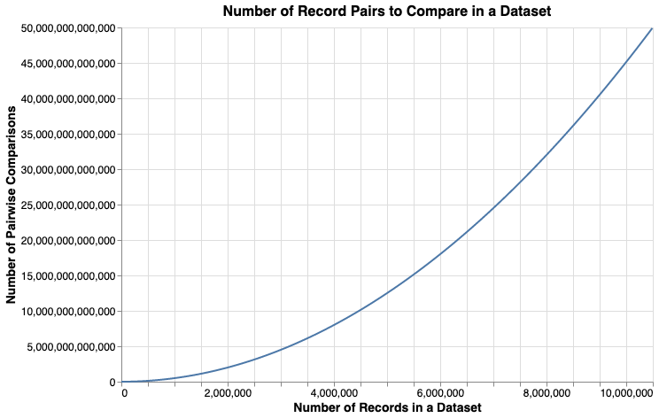

---
tags:
  - Blocking
  - Performance
---

# What are Blocking Rules?

The primary driver the run time of Splink is the number of record pairs that the Splink model has to process.  This is controlled by the blocking rules.

This guide explains what blocking rules are, and how they can be used.

## Introduction

One of the main challenges to overcome in record linkage is the **scale** of the problem.

The number of pairs of records to compare grows using the formula $\frac{n\left(n-1\right)}2$, i.e. with (approximately) the square of the number of records, as shown in the following chart:



For example, a dataset of 1 million input records would generate around 500 billion pairwise record comparisons.

So, when datasets get bigger the computation could get infeasibly large. We use **blocking** to reduce the scale of the computation to something more tractible.

## Blocking

Blocking is a technique for reducing the number of record pairs that are considered by a model.

Considering a dataset of 1 million records, comparing each record against all of the other records in the dataset generates ~500 billion pairwise comparisons. However, we know the vast majority of these record comparisons won't be matches, so processing the full ~500 billion comparisons would be largely pointless (as well as costly and time-consuming).

Instead, we can define a subset of potential comparisons using **Blocking Rules**. These are rules that define "blocks" of comparisons that should be considered. For example, the blocking rule:

`"block_on("first_name", "surname")`

will generate only those pairwise record comparisons where first name and surname match.  That is, is equivalent to joining input records the SQL condition  `l.first_name = r.first_name and l.surname = r.surname`

Within a Splink model, you can specify multiple Blocking Rules to ensure all potential matches are considered.  These are provided as a list.  Splink will then produce all record comparisons that satisfy at least one of your blocking rules.

???+ "Further Reading"

    For more information on blocking, please refer to [this article](https://toolkit.data.gov.au/data-integration/data-integration-projects/probabilistic-linking.html#key-steps-in-probabilistic-linking)

## Blocking in Splink

There are two areas in Splink where blocking is used:

- The first is to generate pairwise comparisons when finding links (running `predict()`). This is the sense in which 'blocking' is usually understood in the context of record linkage.  These blocking rules are provided in the model settings using `blocking_rules_to_generate_predictions`.

- The second is a less familiar application of blocking: using it for model training. This is a more advanced topic, and is covered in the [model training](./model_training.md) topic guide.


### Choosing `blocking_rules_to_generate_predictions`

The blocking rules specified in your settings at `blocking_rules_to_generate_predictions` are the single most important determinant of how quickly your linkage runs.  This is because the number of comparisons generated is usually many multiple times higher than the number of input records.

How can we choose a good set of blocking rules? **It's usually better to use a longer list of strict blocking rules, than a short list of loose blocking rules.**  Let's see why:

The aim of our blocking rules are to:

- Capture as many true matches as possible
- Reduce the total number of comparisons being generated

There is a tension between these aims, because by choosing loose blocking rules which generate more comparisons, you have a greater chance of capturing all true matches.

A single rule is unlikely to be able to achieve both aims.

For example, consider:

```
SettingsCreator(
    blocking_rules_to_generate_predictions=[
        block_on("first_name", "surname")
    ]
)

```
This will generate comparisons for all true matches where names match. But it would miss a true match where there was a typo in the name.

This is why `blocking_rules_to_generate_predictions` is a list.

Suppose we also block on `postcode`:

```py
SettingsCreator(
    blocking_rules_to_generate_predictions=[
        block_on("first_name", "surname"),
        block_on("postcode")
    ]
)
```

Now it doesn't matter if there's a typo in the name so long as postcode matches (and vice versa).

We could take this further and block on, say, `date_of_birth` as well.

By specifying a variety of `blocking_rules_to_generate_predictions`, even if each rule on its own is relatively tight, it becomes implausible that a truly matching record would not be captured by at least one of the rules.

### Tightening blocking rules for linking larger datasets

As the size of your input data grows, tighter blocking rules may be needed.  Blocking on, say `first_name` and `surname` may be insufficiently tight to reduce the number of comparisons down to a computationally tractable number.

In this situation, it's often best to use an even larger list of tighter blocking rules.

An example could be something like:
```py
SettingsCreator(
    blocking_rules_to_generate_predictions=[
        block_on("first_name", "surname", "substr(postcode,1,3)"),
        block_on("surname", "dob"),
        block_on("first_name", "dob"),
        block_on("dob", "postcode")
        block_on("first_name", "postcode")
        block_on("surname", "postcode")
    ]
)
```

### Analysing `blocking_rules_to_generate_predictions`

It's generally a good idea to analyse the number of comparisons generated by your blocking rules **before** trying to use them to make predictions, to make sure you don't accidentally generate trillions of pairs.  You can use the following function to do this:

```py
from splink.blocking_analysis import count_comparisons_from_blocking_rule

br = block_on("substr(first_name, 1,1)", "surname")

count_comparisons_from_blocking_rule(
        table_or_tables=df,
        blocking_rule=br,
        link_type="dedupe_only",
        db_api=db_api,
    )
```

### More complex blocking rules

It is possible to use more complex blocking rules that use non-equijoin conditions.  For example, you could use a blocking rule that uses a fuzzy matching function:

```sql
l.first_name and r.first_name and levenshtein(l.surname, r.surname) < 3
```

However, this will not be executed very efficiently, for reasons described in [this](performance.md) page.
