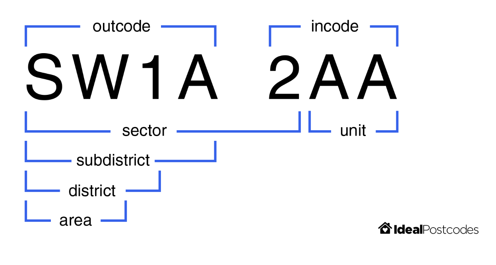

---
tags:
  - API
  - Feature Engineering
  - Comparisons
  - Postcode
  - Phonetic Transformations
  - Soundex
  - Metaphone
  - Double Metaphone
---

# Feature Engineering for Data Linkage

During record linkage, the features in a given dataset are used to provide evidence as to whether two records are a match. Like any predictive model, the quality of a Splink model is dictated by the features provided.

Below are some examples of features that be created from common columns, and how to create more detailed comparisons with them in a Splink model.

<hr>

## Postcodes

In this example, we derive latitude and longitude coordinates from a postcode column to create a more nuanced comparison. By doing so, we account for similarity not just in the string of the postcode, but in the geographical location it represents.  This could be useful if we believe, for instance, that people move house, but generally stay within the same geographical area.

We start with a comparison that uses the postcode's components, For example, UK postcodes can be broken down into the following substrings:


See [image source](https://ideal-postcodes.co.uk/guides/uk-postcode-format) for more details.

The pre-built [postcode comparison](../../api_docs/comparison_library.md#splink.comparison_library.PostcodeComparison) generates a comparison with levels for an exact match on full postcode, sector, district and area in turn.

Code examples to use the comparison template:

```python
import splink.comparison_library as cl

pc_comparison = cl.PostcodeComparison("postcode").get_comparison("duckdb")
print(pc_comparison.human_readable_description)

```

??? note "Output"

    ```
    Comparison 'PostcodeComparison' of "postcode".
    Similarity is assessed using the following ComparisonLevels:
        - 'postcode is NULL' with SQL rule: "postcode_l" IS NULL OR "postcode_r" IS NULL
        - 'Exact match on full postcode' with SQL rule: "postcode_l" = "postcode_r"
        - 'Exact match on sector' with SQL rule: NULLIF(regexp_extract("postcode_l", '^[A-Za-z]{1,2}[0-9][A-Za-z0-9]? [0-9]', 0), '') = NULLIF(regexp_extract("postcode_r", '^[A-Za-z]{1,2}[0-9][A-Za-z0-9]? [0-9]', 0), '')
        - 'Exact match on district' with SQL rule: NULLIF(regexp_extract("postcode_l", '^[A-Za-z]{1,2}[0-9][A-Za-z0-9]?', 0), '') = NULLIF(regexp_extract("postcode_r", '^[A-Za-z]{1,2}[0-9][A-Za-z0-9]?', 0), '')
        - 'Exact match on area' with SQL rule: NULLIF(regexp_extract("postcode_l", '^[A-Za-z]{1,2}', 0), '') = NULLIF(regexp_extract("postcode_r", '^[A-Za-z]{1,2}', 0), '')
        - 'All other comparisons' with SQL rule: ELSE
    ```


Note that this is not able to compute geographical distance by default, because it cannot assume that lat-long coordinates are available.

We now proceed to derive `lat` and `long` columns so that we can take advantage of geographcial distance.  We will use the [ONS Postcode Directory](https://geoportal.statistics.gov.uk/datasets/a2f8c9c5778a452bbf640d98c166657c/about) to look up the lat-long coordinates for each postcode.

Read in a dataset with postcodes:

```python
import duckdb

from splink import splink_datasets

df = splink_datasets.historical_50k

df_with_pc = """
WITH postcode_lookup AS (
    SELECT
        pcd AS postcode,
        lat,
        long
    FROM
        read_csv_auto('./path/to/ONSPD_FEB_2023_UK.csv')
)
SELECT
    df.*,
    postcode_lookup.lat,
    postcode_lookup.long
FROM
    df
LEFT JOIN
    postcode_lookup
ON
    upper(df.postcode_fake) = postcode_lookup.postcode
"""

df_with_postcode = duckdb.sql(df_with_pc)
```

Now that coordinates have been added, a more detailed postcode comparison can be produced using the `postcode_comparison`:


```python
pc_comparison = cl.PostcodeComparison(
    "postcode", lat_col="lat", long_col="long", km_thresholds=[1, 10]
).get_comparison("duckdb")
print(pc_comparison.human_readable_description)
```
??? note "Output"
    ```
    Comparison 'PostcodeComparison' of "postcode", "lat" and "long".
    Similarity is assessed using the following ComparisonLevels:
        - 'postcode is NULL' with SQL rule: "postcode_l" IS NULL OR "postcode_r" IS NULL
        - 'Exact match on postcode' with SQL rule: "postcode_l" = "postcode_r"
        - 'Exact match on transformed postcode' with SQL rule: NULLIF(regexp_extract("postcode_l", '^[A-Za-z]{1,2}[0-9][A-Za-z0-9]? [0-9]', 0), '') = NULLIF(regexp_extract("postcode_r", '^[A-Za-z]{1,2}[0-9][A-Za-z0-9]? [0-9]', 0), '')
        - 'Distance less than 1km' with SQL rule:
            cast(
                acos(

            case
                when (
            sin( radians("lat_l") ) * sin( radians("lat_r") ) +
            cos( radians("lat_l") ) * cos( radians("lat_r") )
                * cos( radians("long_r" - "long_l") )
        ) > 1 then 1
                when (
            sin( radians("lat_l") ) * sin( radians("lat_r") ) +
            cos( radians("lat_l") ) * cos( radians("lat_r") )
                * cos( radians("long_r" - "long_l") )
        ) < -1 then -1
                else (
            sin( radians("lat_l") ) * sin( radians("lat_r") ) +
            cos( radians("lat_l") ) * cos( radians("lat_r") )
                * cos( radians("long_r" - "long_l") )
        )
            end

                ) * 6371
                as float
            )
        <= 1
        - 'Distance less than 10km' with SQL rule:
            cast(
                acos(

            case
                when (
            sin( radians("lat_l") ) * sin( radians("lat_r") ) +
            cos( radians("lat_l") ) * cos( radians("lat_r") )
                * cos( radians("long_r" - "long_l") )
        ) > 1 then 1
                when (
            sin( radians("lat_l") ) * sin( radians("lat_r") ) +
            cos( radians("lat_l") ) * cos( radians("lat_r") )
                * cos( radians("long_r" - "long_l") )
        ) < -1 then -1
                else (
            sin( radians("lat_l") ) * sin( radians("lat_r") ) +
            cos( radians("lat_l") ) * cos( radians("lat_r") )
                * cos( radians("long_r" - "long_l") )
        )
            end

                ) * 6371
                as float
            )
        <= 10
        - 'All other comparisons' with SQL rule: ELSE

    ```


or by using `cll.distance_in_km_level()` in conjunction with other comparison levels:


```python
import splink.comparison_level_library as cll
import splink.comparison_library as cl

custom_postcode_comparison = cl.CustomComparison(
    output_column_name="postcode",
    comparison_description="Postcode",
    comparison_levels=[
        cll.NullLevel("postcode"),
        cll.ExactMatchLevel("postcode"),
        cll.DistanceInKMLevel("lat", "long", 1),
        cll.DistanceInKMLevel("lat", "long", 10),
        cll.DistanceInKMLevel("lat", "long", 50),
        cll.ElseLevel(),
    ],
)
```

<hr>

## Phonetic transformations

Phonetic transformation algorithms can be used to identify words that sound similar, even if they are spelled differently. These are particularly useful for names and can be used as an additional comparison level within name comparisons.

For a more detailed explanation on phonetic transformation algorithms, see the [topic guide](../comparisons/phonetic.md).

### Example

The [`splink_udfs`](https://github.com/moj-analytical-services/splink_udfs) DuckDB extension provides a `double_metaphone` function, so we can derive a [Double Metaphone](../comparisons/phonetic.md#double-metaphone) column directly in DuckDB without needing pandas or an additional python library.

`splink_udfs` is a [DuckDB community extension](https://duckdb.org/community_extensions/), so we install and load it before use:

```python
import duckdb

from splink import splink_datasets

con = duckdb.connect()
con.execute("INSTALL splink_udfs FROM community;")
con.execute("LOAD splink_udfs;")

df = splink_datasets.fake_1000

# double_metaphone returns a list of phonetic codes for each name
df_with_dm = con.sql("""
    SELECT *,
        double_metaphone(first_name) AS first_name_dm,
        double_metaphone(surname) AS surname_dm
    FROM df
""")

df_with_dm.show(max_rows=5)
```
??? note "Output"

    ```
    ┌───────────┬────────────┬─────────┬────────────┬─────────┬─────────────────────┬─────────┬───────────────┬────────────┐
    │ unique_id │ first_name │ surname │    dob     │  city   │        email        │ cluster │ first_name_dm │ surname_dm │
    │   int64   │  varchar   │ varchar │    date    │ varchar │       varchar       │  int64  │   varchar[]   │ varchar[]  │
    ├───────────┼────────────┼─────────┼────────────┼─────────┼─────────────────────┼─────────┼───────────────┼────────────┤
    │         0 │ Robert     │ Alan    │ 1971-06-24 │ NULL    │ robert255@smith.net │       0 │ [RPRT]        │ [ALN]      │
    │         1 │ Robert     │ Allen   │ 1971-05-24 │ NULL    │ roberta25@smith.net │       0 │ [RPRT]        │ [ALN]      │
    │         2 │ Rob        │ Allen   │ 1971-06-24 │ London  │ roberta25@smith.net │       0 │ [RP]          │ [ALN]      │
    │         3 │ Robert     │ Alen    │ 1971-06-24 │ Lonon   │ NULL                │       0 │ [RPRT]        │ [ALN]      │
    │         4 │ Grace      │ NULL    │ 1997-04-26 │ Hull    │ grace.kelly52@jones.com │   1 │ [KRS]         │ NULL       │
    └───────────┴────────────┴─────────┴────────────┴─────────┴─────────────────────┴─────────┴───────────────┴────────────┘
    ```

The `splink_udfs` extension also provides [`soundex`](../comparisons/phonetic.md#soundex) and other string-matching functions. See the [extension documentation](https://github.com/moj-analytical-services/splink_udfs) for the full list.

Now that the dmetaphone columns have been added, they can be used within comparisons. For example, using the `NameComparison` function from the [comparison library](../../api_docs/comparison_library.md).


```python
import splink.comparison_library as cl

comparison = cl.NameComparison("first_name", dmeta_col_name="first_name_dm").get_comparison("duckdb")
comparison.human_readable_description
```

??? note "Output"


    ```
    Comparison 'NameComparison' of "first_name" and "first_name_dm".
    Similarity is assessed using the following ComparisonLevels:
        - 'first_name is NULL' with SQL rule: "first_name_l" IS NULL OR "first_name_r" IS NULL
        - 'Exact match on first_name' with SQL rule: "first_name_l" = "first_name_r"
        - 'Jaro-Winkler distance of first_name >= 0.92' with SQL rule: jaro_winkler_similarity("first_name_l", "first_name_r") >= 0.92
        - 'Jaro-Winkler distance of first_name >= 0.88' with SQL rule: jaro_winkler_similarity("first_name_l", "first_name_r") >= 0.88
        - 'Array intersection size >= 1' with SQL rule: array_length(list_intersect("first_name_dm_l", "first_name_dm_r")) >= 1
        - 'Jaro-Winkler distance of first_name >= 0.7' with SQL rule: jaro_winkler_similarity("first_name_l", "first_name_r") >= 0.7
        - 'All other comparisons' with SQL rule: ELSE
    ```


<hr>

## Full name

If Splink has access to a combined full name column, it can use the term frequency of the full name, as opposed to treating forename and surname as independent.

This can be important because correlations in names are common.  For example, in the UK, “Mohammed Khan” is a more common full name than the individual frequencies of "Mohammed" or "Khan" would suggest.

The following example shows how to do this.

For more on term frequency, see the dedicated [topic guide](../comparisons/term-frequency.md).

### Example

Derive a full name column:

```python
import duckdb

from splink import splink_datasets

df = splink_datasets.fake_1000

df_with_full_name = duckdb.sql("""
    SELECT *, first_name || ' ' || surname AS full_name
    FROM df
""")

df_with_full_name.show(max_rows=5)
```

Now that the `full_name` column has been added, it can be used within comparisons. For example, using the [ForenameSurnameComparison](../../api_docs/comparison_library.md#splink.comparison_library.ForenameSurnameComparison) function from the [comparison library](../../api_docs/comparison_library.md).


```python
comparison = cl.ForenameSurnameComparison(
    "first_name", "surname", forename_surname_concat_col_name="full_name"
)
comparison.get_comparison("duckdb").as_dict()
```
??? note "Output"

    ```
    {'output_column_name': 'first_name_surname',
    'comparison_levels': [{'sql_condition': '("first_name_l" IS NULL OR "first_name_r" IS NULL) AND ("surname_l" IS NULL OR "surname_r" IS NULL)',
    'label_for_charts': '(first_name is NULL) AND (surname is NULL)',
    'is_null_level': True},
    {'sql_condition': '"full_name_l" = "full_name_r"',
    'label_for_charts': 'Exact match on full_name',
    'tf_adjustment_column': 'full_name',
    'tf_adjustment_weight': 1.0},
    {'sql_condition': '"first_name_l" = "surname_r" AND "first_name_r" = "surname_l"',
    'label_for_charts': 'Match on reversed cols: first_name and surname'},
    {'sql_condition': '(jaro_winkler_similarity("first_name_l", "first_name_r") >= 0.92) AND (jaro_winkler_similarity("surname_l", "surname_r") >= 0.92)',
    'label_for_charts': '(Jaro-Winkler distance of first_name >= 0.92) AND (Jaro-Winkler distance of surname >= 0.92)'},
    {'sql_condition': '(jaro_winkler_similarity("first_name_l", "first_name_r") >= 0.88) AND (jaro_winkler_similarity("surname_l", "surname_r") >= 0.88)',
    'label_for_charts': '(Jaro-Winkler distance of first_name >= 0.88) AND (Jaro-Winkler distance of surname >= 0.88)'},
    {'sql_condition': '"surname_l" = "surname_r"',
    'label_for_charts': 'Exact match on surname',
    'tf_adjustment_column': 'surname',
    'tf_adjustment_weight': 1.0},
    {'sql_condition': '"first_name_l" = "first_name_r"',
    'label_for_charts': 'Exact match on first_name',
    'tf_adjustment_column': 'first_name',
    'tf_adjustment_weight': 1.0},
    {'sql_condition': 'ELSE', 'label_for_charts': 'All other comparisons'}],
    'comparison_description': 'ForenameSurnameComparison'}
    ```

Note that the first level is now :

```
{'sql_condition': '"full_name_l" = "full_name_r"',
'label_for_charts': 'Exact match on full_name',
'tf_adjustment_column': 'full_name',
'tf_adjustment_weight': 1.0},
```

whereas without specifying `forename_surname_concat_col_name` we would have had:

```
{'sql_condition': '("first_name_l" = "first_name_r") AND ("surname_l" = "surname_r")',
'label_for_charts': '(Exact match on first_name) AND (Exact match on surname)'},
```
