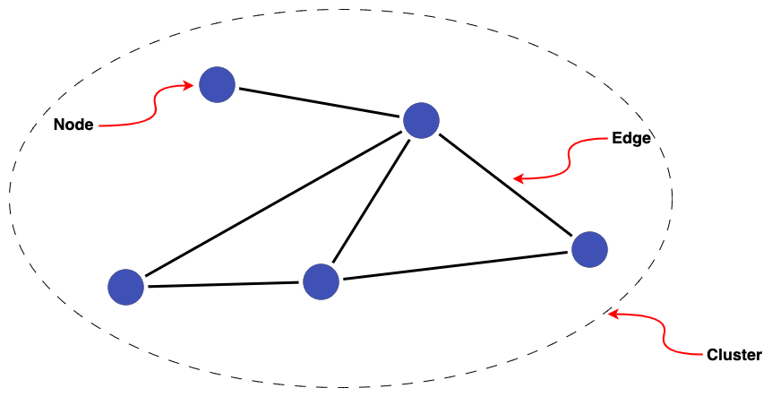
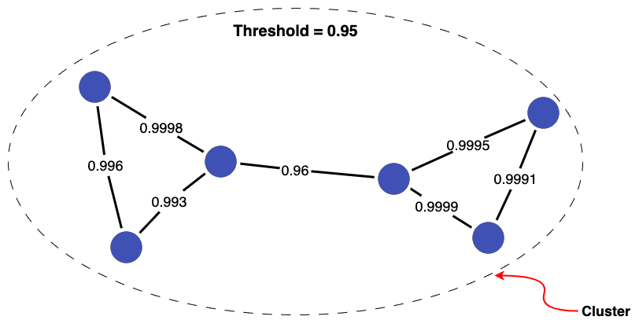

# Linked data as graphs

When you link data, the results can be thought of as a graph, where each record (node) in your data is connected to other records by links (edges).  This guide discusses relevant graph theory.

A graph is a collection of points (referred to in graph theory as nodes or vertices) connected by lines (referred to as edges).

{:width="80%"}

Then a group of interconnected nodes is referred to as a **cluster**.

{:width="80%"}

Graphs provide a natural way to represent linked data, where the nodes of a graph represent records being linked and the edges represent the links between them. So, if we have 5 records (A-E) in our dataset(s), with links between them, this can be represented as a graph like so:

{:width="80%"}

When linking people together, a cluster represents the all of the records in our dataset(s) that refer to the same person. We can give this cluster a new identifier (F) as a way of referring to this single person.

{:width="80%"}

!!! note

    For clusters produced with Splink, every edge comes with an associated Splink score (the probability of two records being a match). The clustering threshold (`match_probability_threshold`) supplied by the user determines which records are included in a cluster, as any links (edges) between records with a match probability below this threshold are excluded.

    Clusters, specifically cluster IDs, are the ultimate output of a Splink pipeline.

## Probabilistic data linkage and graphs

When performing [probabilistic linkage](./probabilistic_vs_deterministic.md), each pair of records has a score indicating how similar they are. For example, consider a collection of records with pairwise similarity scores:

{:width="80%"}

Having a score associated with each pair of records is the key benefit of probabilistic linkage, as we have a measure of similarity of the records (rather than a binary link/no-link). However, we need to choose a threshold at or above which links are considered valid in order to generate our final linked data (clusters).

Let's consider a few different thresholds for the records above to see how the resulting clusters change. Setting a threshold of 0.95 keeps all links, so the records are all joined up into a single cluster.

{:width="80%"}

Whereas if we increase the threshold to 0.99, one link is discarded. This breaks the records into two clusters.

{:width="95%"}

Increasing the threshold further (to 0.999) breaks an additional two links, resulting in a total of three clusters.

{:width="80%"}

This demonstrates that choice of threshold can have a significant impact on the final linked data produced (i.e. clusters). For more specific guidance on selecting linkage thresholds, check out the [Evaluation Topic Guides](../evaluation/overview.md).