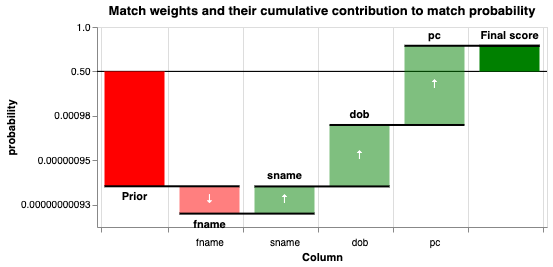

# Types of Record Linkage

There are two main types of record linkage - Deterministic and Probabilistic.

## Deterministic Linkage

Deterministic Linkage is a **rules-based** approach for joining records together.

For example, consider a single table with duplicates:

| AID      | Name                       | DOB        | Postcode |
|----------|----------------------------|------------|----------|
| A00001   | Bob Smith                  | 1990-05-09 | AB12 3CD |
| A00002   | Robert Smith               | 1990-05-09 | AB12 3CD |
| A00003   | Robert "Bobby” Smith       | 1990-05-09 | -        |

and some deterministic rules:

```

IF Name matches AND DOB matches (Rule 1)
THEN records are a match

ELSE

IF Forename matches AND DOB matches AND Postcode match (Rule 2)
THEN records are a match

ELSE

records do not match
```

Applying these rules to the table above leads to no matches:

**A0001-A0002**	No match (different forename)<br/>
**A0001-A0003**	No match (different forename)<br/>
**A0002-A0003**	No match (missing postcode)

 So, even a relatively simple dataset, with duplicates that are obvious to a human, will require more complex rules.


In general, Deterministic linkage is:

<div style="display: flex;">
  <div style="flex: 1;">
    ✅ Computationally cheap  <br>
    ✅ Capable of achieving high precision (few False Positives)
  </div>
  <div style="flex: 1;">
    ❌ Lacking in subtlety  <br>
    ❌ Prone to Low recall (False Negatives)
  </div>
</div>

??? note "Deterministic Linkage in Splink"

    While Splink is primarily a tool for Probabilistic linkage, Deterministic linkage is also supported (utilising blocking rules). See the [example notebooks](../../demos/examples/duckdb/deterministic_dedupe.ipynb) to see how this is Deterministic linkage is implemented in Splink.

## Probabilistic Linkage

Probabilistic Linkage is a **evidence-based** approach for joining records together.

Linkage is probabilistic in the sense that it relies on the balance of evidence. In a large dataset, observing that two records match on the full name 'Robert Smith' provides some evidence that these two records may refer to the same person, but this evidence is inconclusive. However, the cumulative evidence from across multiple features within the dataset (e.g. date of birth, home address, email address) can provide conclusive evidence of a match. The evidence for a match is commonly represented as a probability.

For example, putting the first 2 records of the table above through a probabilistic model gives a an overall probability that the records are a match:


In addition, the breakdown of this probability by the evidence provided by each feature can be shown through a waterfall chart:




Given these probabilities, unlike (binary) Deterministic linkage, the user can choose an **evidence threshold** for what they consider a match before creating a new unique identifier.

This is important, as it allows the linkage to be customised to best support the specific use case. For example, if it is important to:

* minimise False Positive matches (i.e. where False Negatives are less of a concern), a higher threshold for a match can be chosen.
* maximise True Positive matches (i.e. where False Positives are less of a concern), a lower threshold can be chosen.

!!! info "Further Reading"
    For a more in-depth introduction to Probabilistic Data Linkage, including an interactive version of the waterfall chart above, see [Robin Linacre's Blog](https://www.robinlinacre.com/intro_to_probabilistic_linkage/).

??? note "Probabilistic Linkage in Splink"

    Splink is primarily a tool for Probabilistic linkage, and implements the Fellegi-Sunter model - the most common probabilistic record linkage model. See the [Splink Tutorial](../../demos/tutorials/00_Tutorial_Introduction.ipynb) for a step by step guide for Probabilistic linkage in Splink.

    A Topic Guide on the Fellegi-Sunter model is can be found [here](./fellegi_sunter.md)!
